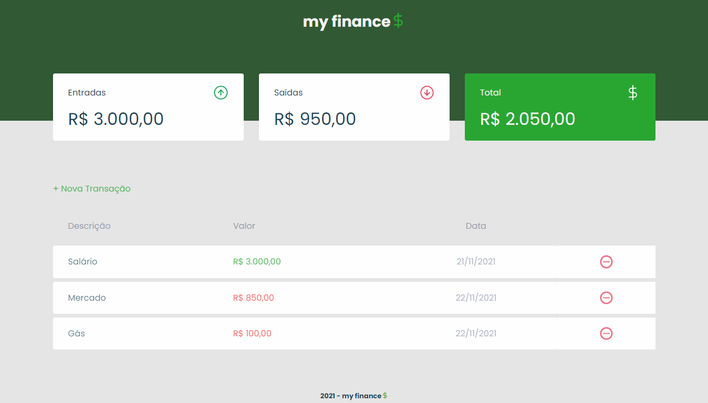

<h1 align="center">my finance$</h1>

  

 
<h2>💸 Sobre</h2>

Projeto elaborado durante a Maratona Discover, realizado pela Rocketseat. A my finances é uma aplicação de controle financeiro, registrando as transações, receitas ou despesas, de uma pessoa ou empresa, além de mostrar um balanço com os valores atualizados referentes as transações. 
Você pode utilizar a aplicação através deste link: <a href="https://matheus-pazinati.github.io/my-finances/">Acessar my finances</a>

 
<h2>🎯 Objetivo</h2>

Desenvolver um CRUD de controle financeiro, aplicando na prática conhecimentos obtidos em DOM (Document Object Model), eventos do Javascript, criação de Modal, HTML e CSS, além de reproduzir fielmente o layout definido pelo designer no Figma.

 
<h2>🚀 Tecnologias utilizadas</h2>
  <ul>
    <li>HTML</li>
    <li>CSS</li>
    <li>Javascript</li>
  </ul>
 
<h2>📌 Melhorias a serem implementadas</h2>
  <ul>
    <li>Salvar os dados no local storage</li>
    <li>Mostrar as transações em ordem de acordo com a data</li>
    <li>Separar as funcionalidades em outros arquivos javascript</li>
  </ul>
 
<h2>🏷️ Layout</h2>

Você pode visualizar o layout do projeto através deste link: <a href="https://www.figma.com/file/7Vu9DzUaCZIV4nibzkjgB4/dev.finance%24-Maratona-Discover/duplicate?node-id=0%3A1">Layout do projeto</a>. É necessário possuir uma conta no <a href="https://figma.com">Figma</a> para acessá-lo.

 
 

Made by Matheus Pazinati 🛸
